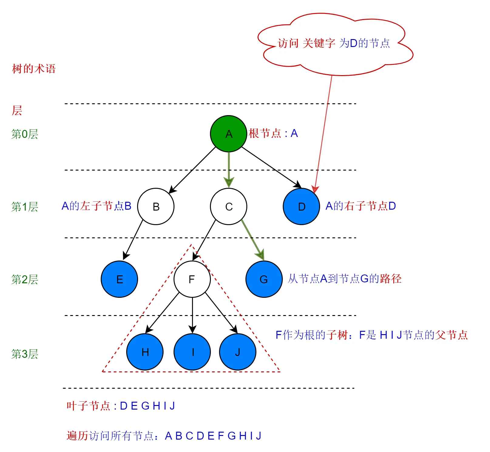

# 数据结构

>数据结构是计算机存储、组织数据的方式，指相互之间存在一种或多种特定关系的数据元素的集合。  

数据结构分类：**线性结构**和**非线性结构。**  
线性结构指的是数据元素之间存在着**一对一**的线性关系。


## 线性结构  

线性结构包括：**数组，链表，队列，栈**  
线性结构有两种不同的存储结构：顺序存储结构、链式存储结构

### 数组

**数组的优缺点**

**优点：**  
1、构建非常简单  
2、能在 O(1) 的时间里根据数组的下标（index）查询某个元素

**缺点：**  
1、构建时必须分配一段连续的空间  
2、查询某个元素是否存在时需要遍历整个数组，耗费 O(n) 的时间（其中，n 是元素的个数）  
3、删除和添加某个元素时，同样需要耗费 O(n) 的时间

特点：**查询快，插入删除慢**  
数组中的元素在内存中连续存储的，可以根据下标快速访问元素，因此，查询速度很快。  
然而插入和删除时，数组元素的位置发生变化，需要对元素移动空间，所以比较慢。  
数组使用场景：频繁查询，很少增加和删除的情况。

**大O表示法**  
O(1)：优秀。例如无序数组插入。  
O(logN)：良好。例如有序的二分查找。  
O(N)：及格。例如无序数组的删除，有序数组的删除和插入，线性查找。  
O(N2)：不及格。例如冒泡排序。  

**总结：**  
插入推荐无序数组，查找推荐有序数组，删除都一样。  
有序数组：插入+ 查找 +删除 = O(N) +O(logN)+O(N);  
无序数组：插入 + 查找 + 删除 = O(1) + O(N) + O(N);  

### 链表

>链表是一种物理存储单元上非连续、非顺序的存储结构，数据元素的逻辑顺序是通过链表中的指针连接次序实现的。  
每一个链表都包含多个节点，节点又包含两个部分，一个是数据域（储存节点含有的信息），一个是引用域（储存下一个节点或者上一个节点的地址）。

单链表：链表中的每个元素实际上是一个单独的对象，而所有对象都通过每个元素中的引用字段链接在一起。  
双链表：与单链表不同的是，双链表的每个结点中都含有两个引用字段。

**链表的优缺点**

**优点：**  
1、链表能灵活地分配内存空间；  
2、能在 O(1) 时间内删除或者添加元素，前提是该元素的前一个元素已知，当然也取决于是单链表还是双链表，在双链表中，如果已知该元素的后一个元素，同样可以在 O(1) 时间内删除或者添加该元素。

**缺点：**  
1、不像数组能通过下标迅速读取元素，每次都要从链表头开始一个一个读取；  
2、查询第 k 个元素需要 O(k) 时间。

特点：**查询慢，插入删除快**  
链表中的元素可以不连续在内存中，是以索引将数据联系起来的，当查询元素的时候需要从头开始查询，所以效率比较低。  
然而添加和删除的只需要修改索引就可以了，所以比较快。  
链表使用场景：如果要解决的问题里面需要很多快速查询，链表可能并不适合；如果遇到的问题中，数据的元素个数不确定，而且需要经常进行数据的添加和删除，那么链表会比较合适。而如果数据元素大小确定，删除插入的操作并不多，那么数组可能更适合。

```java
//单项链表节点类
public class Node {
    public Object data;  //数据域
    public Node next;    //引用域
    public Node(Object e){
        this.data = e;
    }
}
//双项链表节点类
public class Node {
    public Object e;  //作用域
    public Node next; //引用域
    public Node pre;  //引用域
    public Node(){
    }
    public Node(Object e){
        this.e = e;
        next = null;
        pre = null;
    }
}
```
**数组和链表的区别：**  

**链表**  

链表是一种上一个元素的引用指向下一个元素的存储结构，链表通过指针来连接元素与元素。  
链表就是将一系列不连续的内存联系起来，将那种碎片内存进行合理的利用，解决空间的问题。  
链表允许插入和删除表上任意位置上的节点，但是不允许随即存取。  
链表有很多种不同的类型：**单向链表、双向链表及循环链表**。

**数组和链表的区别：**  

不同：  
1、数组是顺序的存储结构；链表是链式的存储结构（不连续，通过指针连接元素）。  
2、数组内存静态分配（栈），链表动态分配（堆）。  
3、链表的插入删除元素相对数组较为简单，不需要移动元素，且较为容易实现长度扩充，但是寻找某个元素较为困难。  
4、数组寻找某个元素较为简单，但插入与删除比较复杂，由于最大长度需要在编程一开始时指定，故当达到最大长度时，扩充长度不如链表方便。  

相同：  
两种结构均可实现数据的顺序存储，构造出来的模型呈线性结构。

### 队列

队列是一种特殊的线性表，它只允许在表的前端进行删除操作，而在表的后端进行插入操作。

**队列的作用：**  

一般情况下，如果是一些及时消息的处理，并且处理时间很短的情况下是不需要使用队列的，直接阻塞式的方法调用就可以了。
但是，如果在消息处理的时候特别费时间，这个时候如果有新的消息来了，就只能处于阻塞状态，造成用户等待。
这个时候在项目中引入队列是十分有必要的。当我们接受到消息后，先把消息放到队列中，然后再用新的线程进行处理，这个时候就不会有消息的阻塞了。

特点：**先进先出**  
队列使用场景：多线程阻塞队列管理非常有用。

**1、基于内存的队列**  

Java的并发包中提供了**BlockingQueue**的实现，比较常用的有ArrayBlockingQueue和LinkedBlockingQueue。  
前者是以数组的形式存储，后者是以Node节点的链表形式存储。  

BlockingQueue 队列常用的操作方法：  
往队列中添加元素: add(), put(), offer()；  
从队列中取出或者删除元素: remove(), element(), peek(), pool(), take()；  

| 方法 | 说明 |
| --- | --- |
| offer() | 往队列添加元素，如果队列已满直接返回false，队列未满则直接插入并返回true |
| add() | 是对offer()方法的简单封装，如果队列已满，抛出异常new IllegalStateException("Queue full") |
| put() | 往队列里插入元素，如果队列已经满，则会一直等待直到队列为空插入新元素，或者线程被中断抛出异常 |
| remove() | 直接删除队头的元素 |
| peek() | 直接取出队头的元素，并不删除 |
| element() | 对peek()方法进行简单封装，如果队头元素存在则取出并不删除，如果不存在抛出异常NoSuchElementException() |
| pool() | 取出并删除队头的元素，当队列为空，返回null |
| take() | 取出并删除队头的元素，当队列为空，则会一直等待直到队列有新元素可以取出，或者线程被中断抛出异常 |

offer()方法一般跟pool()方法相对应, put()方法一般跟take()方法相对应.日常开发过程中offer()与pool()方法用的相对比较频繁。

**2、基于数据库的队列**  

接收到消息之后，把消息存入数据库中，设置消费时间、重试次数等，再用新的线程从数据库中读取信息，进行处理。

### 栈

特点：**先进后出，就像一个箱子**  
栈使用场景：实现递归以及表达式计算，android运用栈的原理实现back stack。  

```java
public class Test {
    public static void main(String[] args) {
        Stack stack = new Stack();
        //empty()栈是否为空
        System.out.println(stack.empty()); //true
        //进栈push()
        stack.push(new Integer(1));
        stack.push("b");
        //peek()栈顶值
        System.out.println(stack.peek()); //b
        //4.pop()出栈
        stack.pop();
        System.out.println(stack.peek()); //1
    }
}
```

## 非线性结构

非线性结构包括：**二维数组，多维数组，广义表，树结构，图结构；**

### 二(多)维数组

多维数组其实是一维数组的嵌套延伸，由于受到多行多列的限制，所以是非线性结构。

```java
public class Test {
     public static void main(String[] args) {
     //二维数组的求累加和并遍历
         int[][] arr = { {1,2},{3,4,5},{6,7,8,9,10} };
         int sum = 0;
         for (int i=0; i<arr.length; i++) {
             for (int j=0; j<arr[i].length; j++) {
                 System.out.println(arr[i][j]);
                 sum += arr[i][j];
             }
         }
         System.out.println("sum= "+ sum);
     }
}
```

### 广义表

广义表是由n个元素组成的序列：LS = (a1，a2, ... an);  
其中ai是一个原子项或者是一个广义表。n是广义表的长度。若ai是广义表，则称为LS的子表。  
广义表表头和表尾：若广义表LS不空，则a1，称为LS的表头，其余元素组成的子表称为表尾。  
广义表的长度：若广义表不空，则广义表所包含的元素的个数，叫广义表的长度。  
广义表的深度：广义表中括号的最大层数叫广义表的深度。  

例如：  
广义表LS=((),a,b,(a,b,c),(a,(a,b),c));  
表头为子表LSH = ();  
表尾为子表LST = (a,b,(a,b,c),(a,(a,b),c));  
广义表LS的长度：5  
广义表LS的深度：3  

### 树结构

> 在计算机科学中，树（英语：tree）是一种抽象数据类型（ADT）或是实现这种抽象数据类型的数据结构，用来模拟具有树状结构性质的数据集合。  
它是由n（n>0）个有限节点组成一个具有层次关系的集合。  
把它叫做“树”是因为它看起来像一棵倒挂的树，也就是说它是根朝上，而叶朝下的。  
它具有以下的特点：  
每个节点都只有有限个子节点或无子节点；  
没有父节点的节点称为根节点；  
每一个非根节点有且只有一个父节点；  
除了根节点外，每个子节点可以分为多个不相交的子树；  
树里面没有环路(cycle)  
—— 维基百科  



**路径**  
从某个节点依次到达另外一个节点所经过的所有节点，就是这两个节点之间的路径。  
**根**  
树顶端的节点被称为根。从根出发到达任意一个节点只有一条路径。  
**父节点**  
除了根节点之外，每个节点都可以向上找到一个唯一的节点，这个节点就是当前节点的父节点。相应的，父节点下方的就是子节点。  
**叶子节点**  
没有子节点的“光杆司令”就被称为叶子节点。  
**子树**  
每个子节点作为根节点的树都是一个子树。  
**层**  
一个树结构的代数就是这个树的层。  
**度**  
一棵树中，最大的节点的度称为树的度。  
**兄弟节点**  
具有相同父节点的节点互称为兄弟节点。

实际应用：十分广泛，例如文件目录系统就是一个树系统，公司部门系统等。

## 二叉树

>在计算机科学中，二叉树是每个结点最多有两个子树的树结构。通常子树被称作“左子树”（left subtree）和“右子树”（right subtree）。二叉树常被用于实现二叉查找树和二叉堆。

二叉树的遍历有三种方式：  
1、前序遍历（DLR），首先访问根结点，然后遍历左子树，最后遍历右子树。简记根-左-右。  
2、中序遍历（LDR），首先遍历左子树，然后访问根结点，最后遍历右子树。简记左-根-右。  
3、后序遍历（LRD），首先遍历左子树，然后遍历右子树，最后访问根结点。简记左-右-根。  
```java
public class Demo{
    
    /**
    *节点
    **/
    public static class TreeNode{
        public int data;
        public TreeNode leftChild;
        public TreeNode rightChild;
    }

    /**
     * 二叉树前序遍历   根-> 左-> 右
     * @param node    二叉树节点
     */
    public static void preOrderTraveral(TreeNode node){
        if(node == null){
            return;
        }
        System.out.print(node.data+" ");
        preOrderTraveral(node.leftChild);
        preOrderTraveral(node.rightChild);
    }

    /**
     * 二叉树中序遍历   左-> 根-> 右
     * @param node   二叉树节点
     */
    public static void inOrderTraveral(TreeNode node){
        if(node == null){
            return;
        }
        inOrderTraveral(node.leftChild);
        System.out.print(node.data+" ");
        inOrderTraveral(node.rightChild);
    }

    /**
     * 二叉树后序遍历   左-> 右-> 根
     * @param node    二叉树节点
     */
    public static void postOrderTraveral(TreeNode node){
        if(node == null){
            return;
        }
        postOrderTraveral(node.leftChild);
        postOrderTraveral(node.rightChild);
        System.out.print(node.data+" ");
    }

    /**
    * 非递归前序
    **/
    public static void preOrderTraveralWithStack(TreeNode node){
        Stack<TreeNode> stack = new Stack<TreeNode>();
        TreeNode treeNode = node;
        while(treeNode!=null || !stack.isEmpty()){
            //迭代访问节点的左孩子，并入栈
            while(treeNode != null){
                System.out.print(treeNode.data+" ");
                stack.push(treeNode);
                treeNode = treeNode.leftChild;
            }
            //如果节点没有左孩子，则弹出栈顶节点，访问节点右孩子
            if(!stack.isEmpty()){
                treeNode = stack.pop();
                treeNode = treeNode.rightChild;
            }
        }
    }

    /**
    * 层序遍历
    **/
    public static void levelOrder(TreeNode root){
        LinkedList<TreeNode> queue = new LinkedList<>();
        queue.add(root);
        while(!queue.isEmpty()){
            root = queue.pop();
            System.out.print(root.data+" ");
            if(root.leftChild!=null) queue.add(root.leftChild);
            if(root.rightChild!=null) queue.add(root.rightChild);
        }
    }

    /**
    * 叉树深度
    **/
    public int maxDepth(TreeNode root) {
        int lchildh,rchildh;
        if(root == null)
            return 0;
        else{
            lchildh = maxDepth(root.left);
            rchildh = maxDepth(root.right);
            return (lchildh > rchildh ? (lchildh + 1) : (rchildh +1) );
        }
    }

    /**
    * 二叉树深度 非递归
    * pCount当前层的节点数
    * preCount前一层的节点数
    */
    public int maxDepth(TreeNode root) {
        if (root == null) {
            return 0;
        }
        Queue<TreeNode> q = new LinkedList<>();
        q.offer(root);
        int preCount = 1;
        int pCount = 0;
        int level = 0;
        while(!q.isEmpty()){
            TreeNode temp = q.poll();
            preCount--;
            if(temp.left != null){
                q.offer(temp.left);
                pCount++;
            }
            if(temp.right != null){
                q.offer(temp.right);
                pCount++;
            }
            if(preCount == 0){
                preCount = pCount;
                pCount = 0;
                level++;
            }
        }
        return level;
    }
}
```

#### 二叉查找树

>二叉查找树的特点就是**左子树的节点值比父亲节点小，而右子树的节点值比父亲节点大**。可以采取类似于二分查找的思想，快速找到某个节点。  

由于二叉查找树会存在一种极端的情况，近似退化成一个链表结构，二叉查找树的查找时间复杂度顿时变成了 O(n)。所以引进了平衡二叉树。

#### 平衡二叉树

>平衡二叉树具有二叉查找树的全部特性，**每个节点的左子树和右子树的高度差至多等于1**。

**为什么有了平衡树还需要红黑树？**

虽然平衡树解决了二叉查找树退化为近似链表的缺点，能够把查找时间控制在 O(logn)，不过却不是最佳的，因为平衡树要求**每个节点的左子树和右子树的高度差至多等于1**，这个要求实在是太严了，导致每次进行插入/删除节点的时候，几乎都会破坏平衡树的第二个规则，进而我们都需要通过**左旋**和**右旋**来进行调整，使之再次成为一颗符合要求的平衡树。

#### 红黑树

1、具有二叉查找树的特点  
2、根节点是黑色的  
3、每个叶子节点都是黑色的空节点（NIL），也就是说，叶子节点不存数据  
4、任何相邻的节点都不能同时为红色，也就是说，红色节点是被黑色节点隔开的  
5、每个节点，从该节点到达其可达的叶子节点的所有路径，都包含相同数目的黑色节点  

正是由于红黑树的这种特点，使得它能够在最坏情况下，也能在 O(logn) 的时间复杂度查找到某个节点。  
不过，与平衡树不同的是，红黑树在插入、删除等操作，不会像平衡树那样，频繁着破坏红黑树的规则，所以不需要频繁着调整，这也是我们为什么大多数情况下使用红黑树的原因。  
**单单在查找方面的效率的话，平衡树比红黑树快。**

**总结**

平衡树是为了解决二叉查找树退化为链表的情况，而红黑树是为了解决平衡树在插入、删除等操作需要频繁调整的情况。

## ArrayList数据结构

ArrayList的底层数据结构就是一个**数组**，数组元素的类型为Object类型，对ArrayList的所有操作底层都是基于数组的。  
ArrayList在多线程的环境下是不能保证具有[原子性](/java/线程、多线程、锁.md)的，因此ArrayList在多线程的环境下是线程不安全的。

|集合|数据结构|是否线程安全|插入、删除效率|获取、更新效率|
|---|---|---|---|---|
|ArrayList|数组|非线程安全|效率低(涉及数组的复制和移动)|效率高|
|Vector|数组|线程安全|效率最低(涉及数组的复制、移动及线程同步)|效率较高(synchronized同步方法修饰)|
|LinkedList|双向链表|非线程安全|效率高|效率低(需要全list遍历)|

## HashMap数据结构

在JDK1.6，JDK1.7中，HashMap采用**数组+链表**实现，即使用链表处理冲突，同一hash值的元素都存储在一个链表里。（但是当位于一个桶中的元素较多时，通过key值依次查找的效率较低。）

而JDK1.8中，HashMap采用**数组+链表+红黑树**实现，当链表长度超过阈值（8）时，将链表转换为红黑树，这样大大减少了查找时间。

**HashMap的实现原理：**

首先有一个链表数组，当添加一个元素(key-value)时，会根据key的hash值和桶的数量来计算数组的下标，以确定插入数组中的位置，
插入相同key值的话就会覆盖之前的value值，如果不同的key值产生了相同的hash值的时候，也就是hash冲突，就会形成一个单向链表，将多个相同hash值的元素存储在链表中，
而当链表长度过长时（阈值8），链表就转换为红黑树，这样可以大大提高查找的效率。

数据结构：数组，单线链表，红黑树（1.8）

特点：快速存储，快速查找，可伸缩（当存储容量达到0.75的时候数组的长度就会变为原来的2倍）。

Hash算法：  
hash算法就是通过hashcode与自己进行向右位移16的异或运算。

**HashMap扩容为什么是2倍**

HashMap数组的初始长度为2的幂次方(16)，随后以2倍扩容的方式扩容，元素在新表中的位置要么不动，要么有规律的出现在新表中（二的幂次方偏移量），这样会使扩容的效率大大提高。

通过`(n - 1) & hash(key)`的位与运算计算下标，使元素均匀的散布hashmap中，减少hash碰撞，也尽可能的减少了元素位置的移动。

### HashMap的默认初始长度为什么是16

如果两个元素不相同，但是hash函数的值相同，这两个元素就是一个碰撞。为了减少hash值的碰撞，需要实现一个尽量均匀分布的hash函数，在HashMap中通过利用key的hashcode值，来进行位运算。

长度16或者其他2的幂，length - 1的值是所有二进制位全为1，这种情况下，index的结果等同于hashcode后几位的值。

如果长度不是16，length-1的二进制就不全是1组成的。这样的话有些index会永远算不出来，降低了空间的利用率。

>[哈希表，哈希冲突](https://mp.weixin.qq.com/s?__biz=MzAxMTI4MTkwNQ==&mid=2650834350&idx=2&sn=f68acb61201ae88d38cd046354d1ca66&chksm=80b75130b7c0d826cd25524910fe6283e450f6ad616f7a0cc6556e91c93a1e721d5759b02b52&scene=132#wechat_redirect)

**为什么会有hash冲突？**  
当存储的元素越来越多的时候，难免会出现不同的key产生相同的hash值的问题（位桶的长度发生改变），那么这个时候就会产生hash冲突，为了解决hash冲突，位桶就会产生一个单向链表，当单向链表长度超过8时就会变成红黑树。

**处理hash冲突的方法有以下几种：**

1、开放地址法  
2、再哈希法  
3、链地址法  
4、建立公共溢出区

### HashMap的链表是头插还是尾插

- JDK 1.7采用头插法来添加链表元素，存在链表成环的问题，1.8中做了优化，采用尾插法来添加链表元素；
- 在扩容时，头插法会改变链表中元素原本的顺序，以至于在并发场景下导致链表成环的问题，而尾插法，在扩容时会保持链表元素原本的顺序，就不会出现链表成环的问题。
- 链表成环只是并发问题中的一种，1.8虽然解决了此问题，但是还是会有很多其他的并发问题（put后get的不是刚才的值），因为没有加锁，不是线程安全的。

### 红黑树退化成链表的条件

- 扩容 resize( ) 时，红黑树拆分成的树的结点数小于等于临界值6个，则退化成链表。
- 移除元素 remove( ) 时，在removeTreeNode( ) 方法会检查红黑树是否满足退化条件，与结点数无关。如果红黑树根 root 为空，或者 root 的左子树/右子树为空，root.left.left 根的左子树的左子树为空，都会发生红黑树退化成链表。

**LinkedHashMap**  
LinkedHashMap继承自HashMap，因此，它具备了HashMap的优良特性，并在此基础上，LinkedHashMap又在内部增加了一个链表，用以存放元素的顺序。因此，LinkedHashMap可以简单理解为一个维护了元素次序表的HashMap。  
LinkedHashMap提供两种类型的顺序：一是元素插入时的顺序；二是最近访问的顺序。

**TreeMap**  
TreeMap可以简单理解为一种可以进行排序的Map实现。与LinkedHashMap不同，LinkedHashMap是根据元素增加或者访问的先后顺序进行排序，而TreeMap则根据元素的Key进行排序。

**HashMap和HashTable以及CurrentHashMap的区别？**

1、HashMap的KV均可为null，而HashTable的KV均不能为null。因此，不是使用get(key)判断HashMap是否存在某个键，而应该用containsKey(key)来判断某个键。  
2、HashMap是非synchronized，而HashTable则是synchronied（这也意味着同一时刻，只能有一个线程获取同步锁，对HashTable的值进行修改）。这意味着HashTable线程安全，而HashMap则不是线程安全的。  
3、HashMap的迭代器是fail-fast(快速失败)迭代器，而HashTable则是fail-safe（安全失败）迭代器。二者的主要区别在于遍历集合时，是否能同时修改集合的元素。  
4、HashMap和HashTable都是插入后扩容，因此有可能产生无效扩容（扩容后不再插入导致空间的浪费），且每次扩容，原来数组中的元素都要重新计算其存放的位置后重新插入。  

JDK5之后提供了ConcurrentHashMap来替代HashTable。ConcurrentHashMap是对HashTable的优化。

1、ConcurrentHashMap采用分段锁，线程安全。  
2、底层实现采用 分段数组+链表。  
3、HashTable进行修改操作时，要锁住整张表，以保证数据安全；而ConcurrentHashMap只需锁住要修改数据所在的那一分片（锁分离技术）。  
4、ConcurrentHashMap是段内插入前扩容，即插入前检查当前有效存储数组的hash值个数是否超过负载因子（默认为总容量的75%，可调参数），若超过，进行段内扩容。  

**分段锁技术**  

1、将数据分成若干段进行存储。  
2、为每一段分配一把锁。  
3、当线程需要对某一段进行增删改查时，需要先获取分段锁，再进行操作，操作完毕再释放。  

**Android中的ArrayMap和HashMap的区别**

ArrayMap是一个<key,value>映射的数据结构，它设计上更多的是考虑内存的优化，内部是使用两个数组进行数据存储，一个数组记录key的hash值，另外一个数组记录Value值，它和SparseArray一样，也会对key使用二分法进行从小到大排序，在添加、删除、查找数据的时候都是先使用二分查找法得到相应的index，然后通过index来进行添加、查找、删除等操作，所以，应用场景和SparseArray的一样，如果在数据量比较大的情况下，那么它的性能将退化至少50%。

<span class="font-red">1.查找效率：</span>HashMap高，ArrayMap略逊于HashMap。  
<span class="font-red">2.扩容效率：</span>ArrayMap高，HashMap每次扩容都是原来的2倍，需要重新计算key的下标将数组成员放到新的位置，ArrayMap长度小于4申请4的长度，小于8申请8的长度，大于8会申请长度的1.5倍空间，并且是直接通过System.arraycopy来进行赋值。  
<span class="font-red">3.内存消耗：</span>HashMap比较消耗内存，ArrayMap能够重复利用因为数据扩容而遗留下来的数组空间,方便下一个ArrayMap的使用，如果频繁使用map，并且数据量都比较小的时候，使用ArrayMap比较节省内存。  

## HashSet数据结构

HashSet实现Set接口，由哈希表（实际上是一个HashMap实例）支持。它不保证set的迭代顺序；特别是它不保证该顺序恒久不变。此类允许使用null元素。

**HashSet实现原理**

对于HashSet而言，它是基于HashMap实现的，HashSet底层使用HashMap来保存所有元素，操作也基本上都是直接调用底层HashMap的相关方法来完成。

根据保存对象的equals和hashCode方法来确保唯一性。

LinkedHashSet,TreeSet都是对应的Map的一种封装。

## 线程安全的数据结构

**1、HashTable**  
HashTable使用synchronized来修饰方法函数来保证线程安全，但是在多线程运行环境下效率表现非常低下。

**2、ConcurrentHashMap**  
ConcurrentHashMap是HashMap的线程安全版。采用了分段锁的技术，将Map存放的数据一段一段的存储，并给每一段分配一把锁，当一个线程占用锁访问其中一个段的数据时，其他段的数据也能被其他线程访问。

**3、CopyOnWriteArrayList**  
CopyOnWriteArrayList类是一个线程安全的List接口的实现，在高并发的情况下，可以提供高性能的并发读取，并且保证读取的内容一定是正确的，这对于读操作远远多于写操作的应用非常适合。

**4、CopyOnWriteArraySet**  
CopyOnWriteArraySet是对CopyOnWriteArrayList使用了装饰模式后的具体实现，可理解为线程安全的Set。

**5、ConcurrentLinkedQueue**  
ConcurrentLinkedQueue应该算是在高并发环境中性能最好的队列；在多线程的队列应用场景中，强烈推荐使用。

**6、Vector**  
Vector中的操作是线程安全的，它是利用synchronized同步锁机制进行实现，其实现方式与HashTable类似。

**7、StringBuffer**  
StringBuffer与StringBuilder常用于字符串拼接；前者线程安全，后者不是线程安全的；在多线程环境中下，考虑数据安全使用前者，否则使用后者。

> [浅谈JAVA数据结构和算法](https://www.cnblogs.com/liaogan-1110/p/11377609.html)  
> [Java数据结构和算法（一）——简介](https://blog.csdn.net/chenshiyang0806/article/details/90744039)  
> [Java知识总结----队列的使用（八）](https://blog.csdn.net/lzy_lizhiyang/article/details/48311925)  
> [广义表操作 (Java实现)——广义表深度、广义表长度、打印广义表信息](https://blog.csdn.net/sun_star1chen/article/details/17882285)  
> [树结构与Java实现](https://blog.csdn.net/sinat_26342009/article/details/89385119)  
> [https://blog.csdn.net/qq_29229567/article/details/87799838](https://blog.csdn.net/qq_29229567/article/details/87799838)