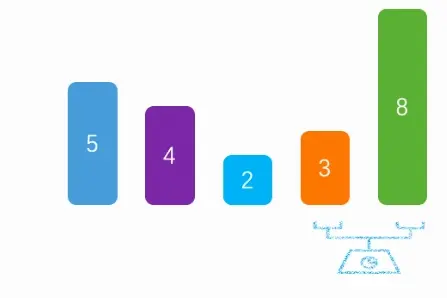
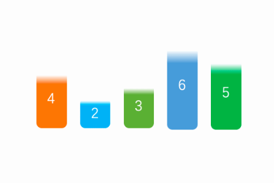
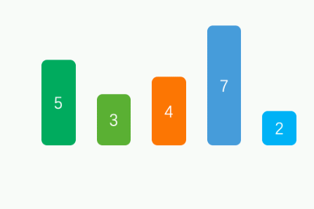
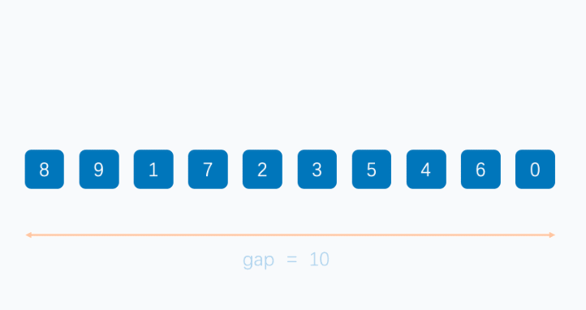
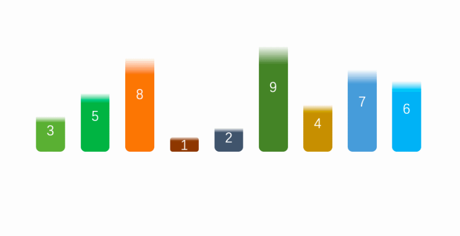
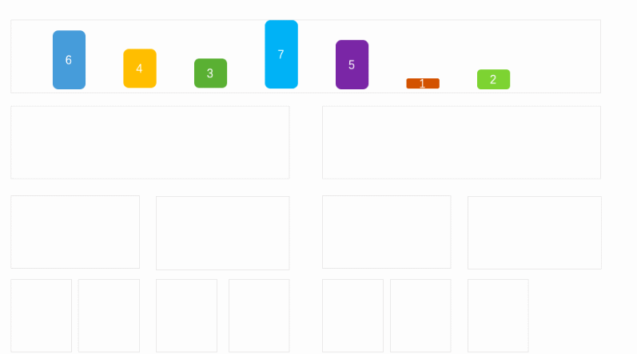

# 算法

>算法简单来说就是解决问题的步骤。

## 算法的五个特征

**1、有穷性**：对于任意一组合法输入值，在执行又穷步骤之后一定能结束，即：算法中的每个步骤都能在有限时间内完成。  
**2、确定性**：在每种情况下所应执行的操作，在算法中都有确切的规定，使算法的执行者或阅读者都能明确其含义及如何执行。并且在任何条件下，算法都只有一条执行路径。  
**3、可行性**：算法中的所有操作都必须足够基本，都可以通过已经实现的基本操作运算有限次实现之。  
**4、有输入**：作为算法加工对象的量值，通常体现在算法当中的一组变量。有些输入量需要在算法执行的过程中输入，而有的算法表面上可以没有输入，实际上已被嵌入算法之中。  
**5、有输出**：它是一组与“输入”有确定关系的量值，是算法进行信息加工后得到的结果，这种确定关系即为算法功能。  

## 算法的设计原则

**1、正确性**：首先，算法应当满足以特定的“规则说明”方式给出的需求。其次，对算法是否“正确”的理解可以有以下四个层次：  
* 1.1、程序语法错误。  
* 1.2、程序对于几组输入数据能够得出满足需要的结果。  
* 1.3、程序对于精心选择的、典型、苛刻切带有刁难性的几组输入数据能够得出满足要求的结果。  
* 1.4、程序对于一切合法的输入数据都能得到满足要求的结果。  
* PS：通常以第三层意义的正确性作为衡量一个算法是否合格的标准。  

**2、可读性**：算法为了人的阅读与交流，其次才是计算机执行。因此算法应该易于人的理解；另一方面，晦涩难懂的程序易于隐藏较多的错误而难以调试。  
**3、健壮性**：当输入的数据非法时，算法应当恰当的做出反应或进行相应处理，而不是产生莫名其妙的输出结果。并且，处理出错的方法不应是中断程序执行，而是应当返回一个表示错误或错误性质的值，以便在更高的抽象层次上进行处理。  
**4、高效率与低存储量需求**：通常算法效率值得是算法执行时间；存储量是指算法执行过程中所需要的最大存储空间，两者都与问题的规模有关。  

## 排序算法 

>所谓排序，就是使一串记录，按照其中的某个或某些关键字的大小，递增或递减的排列起来的操作。  
排序算法，就是如何使得记录按照要求排列的方法。

**简单排序**：冒泡排序、选择排序、插入排序  
**高级排序**：快速排序、归并排序、希尔排序  
相关算法知识：划分、递归、二分查找  

**时间复杂度**  
O(n)这样的标志叫做渐近时间复杂度,是个近似值.各种渐近时间复杂度由小到大的顺序如下：  
O(1) < O(logn) < O(n) < O(nlogn) < O(n^2) < O(n^3) < O(2^n) < O(n!) < O(n^n)

一般时间复杂度到了2^n(指数阶)及更大的时间复杂度,这样的算法我们基本上不会用了,太不实用了.比如递归实现的汉诺塔问题算法就是O(2^n)。平方阶(n^2)的算法是勉强能用,而nlogn及更小的时间复杂度算法那就是非常高效的算法了啊。

**空间复杂度**  
冒泡排序,简单选择排序,堆排序,直接插入排序,希尔排序的空间复杂度为O(1),因为需要一个临时变量来交换元素位置,(另外遍历序列时自然少不了用一个变量来做索引)  
快速排序空间复杂度为logn(因为递归调用了) ,归并排序空间复杂是O(n),需要一个大小为n的临时数组。基数排序的空间复杂是O(n),桶排序的空间复杂度不确定

|排序法|最差时间分析|平均时间复杂度|稳定度|空间复杂度|
|---|---|---|---|---|
|冒泡排序|O(n2)|O(n2)|稳定|O(1)|
|选择排序|O(n2)|O(n2)|不稳定|O(1)|
|插入排序|O(n2)|O(n2)|稳定|O(1)|
|快速排序|O(n2)|O(n*log2n)|不稳定|O(log2n)~O(n)|
|希尔排序|O|O|不稳定|O(1)|
|二叉树排序|O(n2)|O(n*log2n)|不一顶|	O(n)|
|堆排序|O(n*log2n)|O(n*log2n)|不稳定|O(1)|

### 冒泡排序



1、冒泡排序，是通过每一次遍历获取最大/最小值；  
2、将最大值/最小值放在尾部/头部；  
3、然后除开最大值/最小值，剩下的数据在进行遍历获取最大/最小值。

```java
public class Test {
    public static void main(String[] args) {
        int arr[] = {8, 5, 3, 2, 4};
        //冒泡
        for (int i = 0; i < arr.length; i++) {
            //外层循环，遍历次数
            for (int j = 0; j < arr.length - i - 1; j++) {
                //内层循环，升序（如果前一个值比后一个值大，则交换）
                //内层循环一次，获取一个最大值
                if (arr[j] > arr[j + 1]) {
                    int temp = arr[j + 1];
                    arr[j + 1] = arr[j];
                    arr[j] = temp;
                }
            }
        }
    }    
}
```

### 选择排序



1、将第一个值看成最小值；  
2、然后和后续的比较找出最小值和下标；  
3、交换本次遍历的起始值和最小值；  
4、说明：每次遍历的时候，将前面找出的最小值，看成一个有序的列表，后面的看成无序的列表，然后每次遍历无序列表找出最小值。

```java
public class Test {
    public static void main(String[] args) {
        int arr[] = {6, 5, 3, 2, 4};
        //选择
        for (int i = 0; i < arr.length; i++) {
            //默认第一个是最小的。
            int min = arr[i];
            //记录最小的下标
            int index = i;
            //通过与后面的数据进行比较得出，最小值和下标
            for (int j = i + 1; j < arr.length; j++) {
                if (min > arr[j]) {
                    min = arr[j];
                    index = j;
                }
            }
            //然后将最小值与本次循环的，开始值交换
            int temp = arr[i];
            arr[i] = min;
            arr[index] = temp;
            //说明：将i前面的数据看成一个排好的队列，i后面的看成一个无序队列。每次只需要找无需的最小值，做替换
        }
    }
}
```

### 插入排序



1、默认从第二个数据开始比较；  
2、如果第二个数据比第一个小，则交换。然后再用第三个数据比较，如果比前面小，则插入。否则，退出循环；  
3、说明：默认将第一数据看成有序列表，后面无序的列表循环每一个数据，如果比前面的数据小则插入（交换）。否则退出。

```java
public class Test {
    public static void main(String[] args) {
        int arr[] = {7, 5, 3, 2, 4};
        //插入排序
        for (int i = 1; i < arr.length; i++) {
            //外层循环，从第二个开始比较
            for (int j = i; j > 0; j--) {
                //内存循环，与前面排好序的数据比较，如果后面的数据小于前面的则交换
                if (arr[j] < arr[j - 1]) {
                    int temp = arr[j - 1];
                    arr[j - 1] = arr[j];
                    arr[j] = temp;
                } else {
                    //如果不小于，说明插入完毕，退出内层循环
                    break;
                }
            }
        }
    }
}
```

### 希尔排序



1、基本上和插入排序一样的道理；  
2、不一样的地方在于，每次循环的步长，通过减半的方式来实现；  
3、说明：基本原理和插入排序类似，不一样的地方在于。通过间隔多个数据来进行插入排序。

```java
public class Test {
    public static void main(String[] args) {
        int arr[] = {7, 5, 3, 2, 4};
        //希尔排序（插入排序变种版）
        for (int i = arr.length / 2; i > 0; i /= 2) {
            //i层循环控制步长
            for (int j = i; j < arr.length; j++) {
                //j控制无序端的起始位置
                for (int k = j; k > 0  && k - i >= 0; k -= i) {
                    if (arr[k] < arr[k - i]) {
                        int temp = arr[k - i];
                        arr[k - i] = arr[k];
                        arr[k] = temp;
                    } else {
                        break;
                    }
                }
            }
            //j,k为插入排序，不过步长为i
        }
    }
}
```

### 快速排序



1、确认列表第一个数据为中间值，第一个值看成空缺（低指针空缺）；  
2、然后在剩下的队列中，看成有左右两个指针（高低）； 
3、开始高指针向左移动，如果遇到小于中间值的数据，则将这个数据赋值到低指针空缺，并且将高指针的数据看成空缺值（高指针空缺）。然后先向右移动一下低指针，并且切换低指针移动；  
4、当低指针移动到大于中间值的时候，赋值到高指针空缺的地方。然后先高指针向左移动，并且切换高指针移动。重复c、d操作；  
5、直到高指针和低指针相等时退出，并且将中间值赋值给对应指针位置；  
6、然后将中间值的左右两边看成行的列表，进行快速排序操作。  

```java
public class Test {
    public static void main(String[] args) {
        int arr[] = {7, 5, 3, 2, 4, 1, 8, 9, 6};
        //快速排序
        int low = 0;
        int high = arr.length - 1;
        quickSort(arr, low, high);  
    }
    
    public static void quickSort(int[] arr, int low, int high) {
        //如果指针在同一位置(只有一个数据时)，退出
        if (high - low < 1) {
            return;
        }
        //标记，从高指针开始，还是低指针（默认高指针）
        boolean flag = true;
        //记录指针的其实位置
        int start = low;
        int end = high;
        //默认中间值为低指针的第一个值
        int midValue = arr[low];
        while (true) {
            //高指针移动
            if (flag) {
                //如果列表右方的数据大于中间值，则向左移动
                if (arr[high] > midValue) {
                    high--;
                } else if (arr[high] < midValue) {
                    //如果小于，则覆盖最开始的低指针值，并且移动低指针，标志位改成从低指针开始移动
                    arr[low] = arr[high];
                    low++;
                    flag = false;
                }
            } else {
                //如果低指针数据小于中间值，则低指针向右移动
                if (arr[low] < midValue) {
                    low++;
                } else if (arr[low] > midValue) {
                    //如果低指针的值大于中间值，则覆盖高指针停留时的数据，并向左移动高指针。切换为高指针移动
                    arr[high] = arr[low];
                    high--;
                    flag = true;
                }
            }
            //当两个指针的位置相同时，则找到了中间值的位置，并退出循环
            if (low == high) {
                arr[low] = midValue;
                break;
            }
        }
        //然后出现有，中间值左边的小于中间值。右边的大于中间值。
        //然后在对左右两边的列表在进行快速排序
        quickSort(arr, start, low -1);
        quickSort(arr, low + 1, end);
    }
}
```

### 归并排序



1、将列表按照对等的方式进行拆分；  
2、拆分小最小快的时候，在将最小块按照原来的拆分，进行合并；  
3、合并的时候，通过左右两块的左边开始比较大小。小的数据放入新的块中；  
4、说明：简单一点就是先对半拆成最小单位，然后将两半数据合并成一个有序的列表。

```java
public class Test {
    public static void main(String[] args) {
        int arr[] = {7, 5, 3, 2, 4, 1, 6};
        //归并排序
        int start = 0;
        int end = arr.length - 1;
        mergeSort(arr, start, end);
    }
    
    public static void mergeSort(int[] arr, int start, int end) {
        //判断拆分的不为最小单位
        if (end - start > 0) {
            //再一次拆分，知道拆成一个一个的数据
            mergeSort(arr, start, (start + end) / 2);
            mergeSort(arr, (start + end) / 2 + 1, end);
            //记录开始/结束位置
            int left = start;
            int right = (start + end) / 2 + 1;
            //记录每个小单位的排序结果
            int index = 0;
            int[] result = new int[end - start + 1];
            //如果查分后的两块数据，都还存在
            while (left <= (start + end) / 2 && right <= end) {
                //比较两块数据的大小，然后赋值，并且移动下标
                if (arr[left] <= arr[right]) {
                    result[index] = arr[left];
                    left++;
                } else {
                    result[index] = arr[right];
                    right++;
                }
                //移动单位记录的下标
                index++;
            }
            //当某一块数据不存在了时
            while (left <= (start + end) / 2 || right <= end) {
                //直接赋值到记录下标
                if (left <= (start + end) / 2) {
                    result[index] = arr[left];
                    left++;
                } else {
                    result[index] = arr[right];
                    right++;
                }
                index++;
            }
            //最后将新的数据赋值给原来的列表，并且是对应分块后的下标。
            for (int i = start; i <= end; i++) {
                arr[i] = result[i - start];
            }
        }
    }
}
```

> [Java的几种常见排序算法](https://www.cnblogs.com/ll409546297/p/10956960.html)