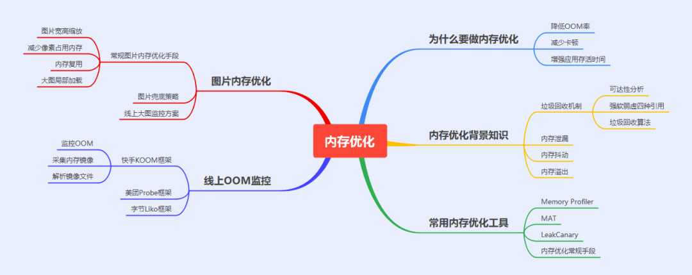

# 优化相关

- [包体积优化](#包体积优化)
- [稳定性优化](#稳定性优化)
- [内存优化](#内存优化)
- [存储优化](#存储优化)
- [WebView优化](#WebView优化)
- [启动优化](#启动优化)
- [Bitmap优化](#Bitmap优化)


## 包体积优化

包体积优化好处：

- 提升下载转化率，安装包越小，转化率越高。
- 降低渠道推广成本。
- 降低安装时间，文件拷贝、Library解压、编译ODEX、签名校验这些，包体积越大越耗时。
- 降低运行时内存等等。

APK本质是一个压缩文件，是打包后的产物，那可以作为切入点的阶段就是打包前、以及打包中。
- 打包前，即减少打包的文件，比如无用的资源、代码；
- 打包中，对打包中的产物进行压缩，比如资源文件、So文件；

关键词：减少、压缩。

- 通过lint检查无用资源，由于lint是本地静态扫描，动态引入的资源文件不会识别，所以我们可以编写Python脚本，将未使用的资源在代码里再扫描一遍，确定无引用后进行删除。
- 图片压缩，通过TinyPng进行在线压缩，可以使用TinyPng插件直接压缩，压缩后还可以选择将图片的格式转换成WebP格式，AS也提供了一键转换的支持。 
还有就是同时存在2倍图和3倍图的情况下，我们删除相同的2倍图，只保留3倍图。（可以通过Python脚本或者Gradle插件进行删除）
- so文件缩减，市面上的手机大多都是arm架构的，所以保留armeabi-v7a或armeabi都可。
- 移除未使用的资源，比如我们不是出海的应用没必要做国际化，但是有不少SDK包含了国际化的资源，我们可以在gradle中统一配置支持的语言，资源文件也可以同理配置。
- 资源混淆，比如缩短资源文件的路径，如res/drawable/icon变为r/d/i，可以使用腾讯开源工具[AndResGuard](https://github.com/shwenzhang/AndResGuard)。
- so文件动态加载，也就是插件化的思想，按需加载，但是需要考虑加载的时机，网络环境，加载失败后的降级策略。
- 原生改用H5或小程序，如果本身不支持小程序的话就没必要了，反而会增大体积，适合平台化的大型项目。
- 使用字节开源[shrink-r-plugin](https://github.com/bytedance/ByteX/blob/master/shrink-r-plugin/README-zh.md)或滴滴开源[booster](https://github.com/didi/booster)来
进行R文件常量内联，R文件瘦身（升级AGP4.1版本后`minifyReleaseWithR8`这个task会对R文件进行内联，将常量引用替换成常量值，这样代码中将不会有对R文件的引用，在shrink的时候会将R文件删除），以及检查无用的资源等。


## 稳定性优化

> Crash：运行过程中发生的错误，是无法避免的。

> ANR：应用在运行时，由于无法在规定的时间段内响应完系统做出的一个操作。

ANR 的原理是 AMS 在 UI 操作开始的时候，会根据 UI 操作的类型开启一个延时任务，如果这个任务被触发了，就表示应用卡死或者响应过慢。这个任务会在 UI 操作结束的时候被移除。

## 内存优化



- 检测内存泄漏并优化。（静态变量、匿名内部类、资源对象未回收、无用的监听、WebView等）
- 检测内存抖动并优化。（避免循环体创建对象，避免onDraw()方法中创建对象，可以复用的对象可以缓存起来）
- 图片内存优化，[Bitmap优化](#Bitmap优化)。
- 数据量小的情况下，使用ArrayMap代替HashMap。
- 线上oom监测。

1）、使用LargeHeap属性增加最大可用内存。  
2）、在系统触发资源紧张回调时，主动删除缓存。  
3）、使用优化过后的集合：如SparseArray类等。  
4）、谨慎使用 SharedPreference,SP会在应用初始化时将所有内容加载到内存中，所以不应该存放比较大的内容。  
5）、谨慎使用外部库，引入时需要明确不会对应用性能造成大的影响。  
6）、业务架构设计要合理,抽象可以优化代码的灵活性和可维护性，但是抽象也会带来其他成本,应权衡使用。

## 存储优化

- sp的优化：使用单例，在application的attachBaseContext方法中初始化，为后续使用减少开销。尽量使用apply异步写入磁盘，尽量不要存储大量的数据，比如比较大的json等，数据量大的情况下可以采用多个sp文件存储，避免一个大文件影响读取速度。
- 使用腾讯开源库MMKV，MMKV 是基于 mmap 内存映射的 key-value 组件，底层序列化/反序列化使用 protobuf 实现，性能高，稳定性强。
- protobuf 是google开源的一个序列化框架，类似xml，json，最大的特点是基于二进制，比传统的XML表示同样一段内容要短小得多。MMKV基于protobuf协议进行数据存储，存储方式为增量更新，也就是不需要每次修改数据都要重新将所有数据写入文件了。

Linux通过将一个虚拟内存区域与一个磁盘上的对象关联起来，以初始化这个虚拟内存区域的内容，这个过程称为内存映射(memory mapping)。

Linux采用了分页来管理内存，存入数据先要创建一个文件，并要给这个文件分配一个固定的大小。如果存入了一个很小的数据，那么这个文件其余的内存就会被浪费。相反如果存入的数据比文件大，就需要动态扩容。

MMAP对文件的读写操作只需要从磁盘到用户主存的一次数据拷贝过程，减少了数据的拷贝次数，提高了文件读写效率。  
MMAP使用逻辑内存对磁盘文件进行映射，操作内存就相当于操作文件，不需要开启线程，操作MMAP的速度和操作内存的速度一样快；  
MMAP提供一段可供随时写入的内存块，App 只管往里面写数据，由操作系统如内存不足、进程退出等时候负责将内存回写到文件，不必担心 crash 导致数据丢失。

**SP的缺点**：  
- SP第一次加载数据时需要全量加载，当数据量大时可能会阻塞UI线程造成卡顿
- SP读写文件不是类型安全的，且没有发出错误信号的机制，缺少事务性API
- commit() / apply()操作可能会造成ANR问题

**DataStore**：  
旨在替代原有的 SharedPreferences，支持SharedPreferences数据的迁移。  
基于 Kotlin 协程和 Flow 开发,保证了在主线程的安全性。  
提供两种不同的实现:  
Preferences DataStore：使用键存储和访问数据。  
Proto DataStore： 将数据作为自定义数据类型的实例进行存储。  
以事务方式处理更新数据，事务有四大特性（原子性、一致性、 隔离性、持久性）

## WebView优化

- 资源缓存，将请求的资源替换成本地资源提升加载速度，当WebView回调`shouldInterceptRequest(...)`方法时，将其包装成WebResourceResponse进行返回。
- 使用WebView缓存池，在APP启动时应该就要调用WebViewPool的初始化方法新建一个WebView。
- 腾讯VasSonic开源库，将WebView初始化和WebView加载数据这两个操作由原本的串行改为并行，缩短整体的加载时间。

VasSonic大概的流程为：WebView开始初始化时启动一个子线程去下载html数据，当WebView初始化完的时候通知子线程已经初始化完毕，此时数据下载有3种情况：1、子线程还没开始下载数据；2、子线程下载了一部分数据；3、子线程已经下载完了数据。收到WebView初始化完的消息后，子线程将已经下载的数据和没有下载的数据拼接为桥接流返回给内核渲染。

## 启动优化

- 异步初始化，将启动任务放到一个任务队列中进行初始化。（多任务有依赖关系可以使用有向无环图将各个任务排列起来）
- 延迟加载，进入主界面并且绘制完之后进行加载。
- 使用jetpack的startup来进行预初始化。

## 简单的性能优化

**一、布局优化**

①布局复用，使用<include>标签重用layout。  
②提高显示速度，使用<ViewStub>延迟View加载。  
③减少层级，使用<merge>标签替换父级布局。  
④注意使用wrap_content，会增加measure计算成本。  
⑤删除控件中无用属性。  
⑥避免过度绘制(描述的是屏幕上的某个像素在同一帧的时间内被绘制了多次)。

**二、绘制优化**

①onDraw()中不要创建新的局部对象。  
②onDraw()方法中不要做耗时的任务，会造成View的绘制过程不流畅。

**三、内存泄漏优化**

优化代码使用方式，使用内存泄漏工具Memory Monitor、LeakCanary等检查代码。

**四、响应速度优化**

避免在主线程中做耗时操作，比如网络请求，文件解析等。应采用子线程，异步的方式进行。  
启动页(闪屏页)采用分布加载、异步加载、延期加载策略来提高应用启动速度。

**五、ListView/RecycleView及Bitmap优化**

①使用ViewHolder模式来提高效率。  
②异步加载：耗时的操作放在异步线程中。  
③ListView/RecycleView在滑动时停止加载和分页加载。  
④对大图片进行压缩，避免加载图片过大造成OOM。

BitmapRegionDecoder，图片区域加载类。

**六、线程优化**

尽量使用线程池，避免每次都创建一个Thread对象。

**七、APK瘦身**

①代码混淆：使用proGuard代码混淆器工具，它包括压缩、优化、混淆等功能。  
②资源优化：比如使用Android Lint删除冗余资源，资源文件最少化等。  
③图片优化：比如利用AAPT工具对PNG格式的图片做压缩处理，降低图片色彩位数等。  
④避免重复功能的库，使用 WebP图片格式等。  
⑤插件化：比如功能模块放在服务器上，按需下载，可以减少安装包大小。

## Bitmap优化

### Bitmap占用内存

`bitmap.width * bitmap.height * 一个像素点占用的字节数`

Bitmap内存占用 ≈ 像素数据总大小 = 图片宽 × 图片高× (当前设备密度dpi/图片所在文件夹对应的密度dpi）^2 × 每个像素的字节大小

通过Bitmap的getByteCount()可获取图片的大小 ，getAllocationByteCount()是Bitmap的大小

因为Bitmap可以复用，所以Bitmap可以放入不同的图片，当Bitmap放入更大的图片的时候，就会占用更大的内存，但是这个时候如果对Bitmap对象进行复用，放入一张小图片，并不会改变Bitmap的大小。

### 优化

- 编码

|编码|描述|
|--|--|
|ALPHA_8|表示8位Alpha位图,即A=8,一个像素点占用1个字节,它没有颜色,只有透明度|
|ARGB_4444|表示16位ARGB位图，即A=4,R=4,G=4,B=4,一个像素点占4+4+4+4=16位，2个字节|
|ARGB_8888|表示32位ARGB位图，即A=8,R=8,G=8,B=8,一个像素点占8+8+8+8=32位，4个字节|
|RGB_565|表示16位RGB位图,即R=5,G=6,B=5,它没有透明度,一个像素点占5+6+5=16位，2个字节|

A代表透明度；R代表红色；G代表绿色；B代表蓝色。  
也即是说我们可以通过改变图片格式，来改变每个像素占用字节数，来改变占用的内存。

从ARGB_8888 变成了RGB_565 ，像素占用字节数减少了一般，根据log内存也减少了一半，这种方式可行。  
注意：由于ARGB_4444的画质惨不忍睹，一般假如对图片没有透明度要求的话，可以改成RGB_565，相比ARGB_8888将节省一半的内存开销。

- 采样、质量压缩

我们根据BitmapFactory的采样率进行压缩设置采样率，不能小于1， 假如是2则宽为之前的1/2，高为之前的1/2，一共缩小1/4。

`bitmap.compress(Bitmap.CompressFormat.JPEG, 20, new FileOutputStream("sdcard/result.jpg"));`

- 复用

图片复用指的是inBitmap这个属性。

不使用这个属性，你加载三张图片，系统会给你分配三份内存空间，用于分别储存这三张图片。

如果用了inBitmap这个属性，加载三张图片，这三张图片会指向同一块内存，而不用开辟三块内存空间。

inBitmap的限制：  
3.0-4.3 ：复用的图片大小必须相同 ，编码必须相同  
4.4以上 ：复用的空间大于等于即可 ，编码不必相同  
不支持WebP  
图片复用，这个属性必须设置为true； options.inMutable = true;

- LRU缓存

我们可以利用LRU开管理Bitmap，给他设置内存最大值，及时回收

使用BitmapRegionDecoder来加载高清大图，分区域显示。

```java
//支持传入图片的路径，流和图片修饰符等
BitmapRegionDecoder mDecoder = BitmapRegionDecoder.newInstance(path, false);
//需要显示的区域就有由rect控制，options来控制图片的属性
Bitmap bitmap = mDecoder.decodeRegion(mRect, options);
```


> [https://blog.csdn.net/yechaoa/article/details/120630568](https://blog.csdn.net/yechaoa/article/details/120630568)
> [https://www.jianshu.com/p/74c9422dfc39](https://www.jianshu.com/p/74c9422dfc39)