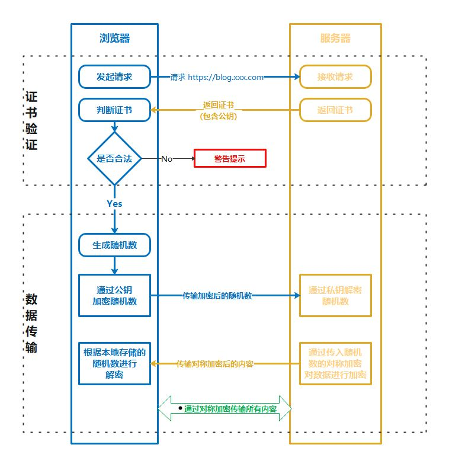

# Https原理和请求过程

## 原理

> 因为HTTP有被窃听、被篡改、被冒充的风险，所以我们需要对HTTP请求进行加密，也就是在HTTP下面加入SSL层，进行证书的校验和数据的加密传输。

服务端需要在公认的证书颁发机构（CA）申请证书，证书一般包含了有效期、证书所有者、公钥、签名等信息；
当客户端发起HTTPS请求时，服务端需要将证书发送给客户端进行验证，验证通过后才能进行有效的数据传输。

- 客户端发起请求时会携带所支持的SSL版本，加密算法和Hash算法等信息；
- 服务端接收到请求后会选择加密算法与Hash算法，将自己的身份信息以证书的形式返回给客户端；
- 客户端首先会去验证证书的有效性（也就是证书颁发机构），查看是否可信任；
- 证书可信则根据本地根证书的CA公钥解密服务器证书获得内容和签名，验证签名、域名、有效期等；
- 如果验证通过，就使用服务器提供的公钥加密一串随机值发送给服务端；
- 服务端接收加密数据后使用私钥进行解密，得到随机值；
- 服务端将解密后的随机值作为私钥对数据进行加密（选择的加密算法）然后返回给客户端；
- 客户端用这个随机值（私钥）对服务端返回的数据进行解密，完成数据传输。

Https在传输证书和秘钥的过程中，使用的是非对称加密算法（保证绝对安全）；
完成验证后使用的是对称算法进行数据传输（保证传输效率）。

## 请求过程
    
**第一步：DNS解析获取服务器IP和端口号**
- 本地dns解析器缓存
- host文件域名映射
- dns服务器查询获取解析

**第二步：TCP三次握手链接**
- 客户端发送syn数据包给服务器（SYN=1、Seq=X）
- 服务器收到后返回一个syn响应包给客户端（SYN=1、ACK=X+1、Seq=Y）
- 客户端收到后回传一个数据包给服务器表示确认（ACK=Y+1、Seq=Z）

**第三步：证书验证**  
- 客户端发起https请求（包含支持的SSL版本，加密算法等）
- 服务端接受请求并返回证书（包含公钥，选择的加密算法等）
- 客户端解析证书（无效则警告）

**第四步：数据传输**
- 客户端给服务端发送用证书公钥加密后的随机值
- 服务端接收加密数据后使用私钥进行解密，得到随机值
- 服务端将解密后的随机值作为私钥对数据进行加密（选择的加密算法）然后返回给客户端
- 客户端用这个随机值（私钥）对服务端返回的数据进行解密，完成数据传输

**注意**：Https在传输证书和秘钥的过程中，使用的是非对称加密算法（保证绝对安全）；完成验证后使用的是对称算法进行数据传输（保证传输效率）。

**客户端解析证书**

- 客户端验证证书内容的有效性（过期时间，域名是否相同等）。
- 客户端根据本地根证书的（CA公钥）解密证书的数字摘要，看看是否匹配。
- 如果数字签名验证通过，就使用服务器提供的公钥进行下一步通信。

> [https原理拆解（附运行流程图） - 知乎 (zhihu.com)](https://zhuanlan.zhihu.com/p/383254610)  
> [一图说明HTTPS请求过程_我的笨毛毛的博客-CSDN博客_https的请求流程](https://blog.csdn.net/u013998466/article/details/108227756)