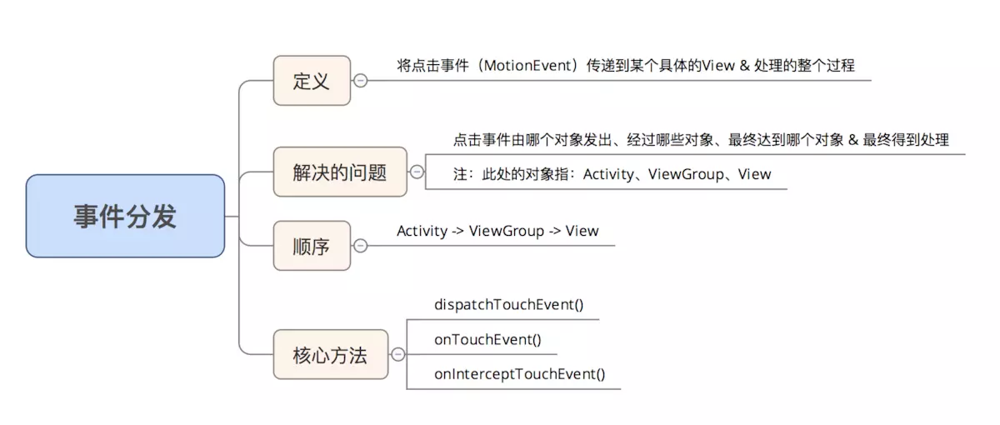

# View事件分发

1、事件分发对象：点击事件（Touch事件）  
2、事件分发本质：将点击事件（MotionEvent）传递到某个具体的View并处理的整个过程  
3、事件传递的对象：Activity、ViewGroup、View  
4、事件传递的顺序：Activity -> ViewGroup -> View  
5、事件分发过程由哪些方法协作完成：dispatchTouchEvent() 、onInterceptTouchEvent()和onTouchEvent()  

|  方法名  |  作用  |  调用时刻  |
|  ---  |  ---  |  ---  |
|  dispatchTouchEvent()  |  分发(传递)事件  |  当点击事件能够传给当前View时，该方法会调用  |
|  onTouchEvent()  |  处理点击事件  |  在dispatchTouchEvent()内部调用  |
|  onInterceptTouchEvent()  |  判断是否拦截了某个事件(只存在于ViewGroup，View内无此方法)  |  在ViewGroup的dispatchTouchEvent()方法内调用  |

**总结：**

## Activity的事件分发机制

!> 当一个点击事件发生时，事件最先传到Activity的dispatchTouchEvent()进行事件分发

## ViewGroup的事件分发机制

!> 从上面Activity事件分发机制可知，ViewGroup事件分发机制从dispatchTouchEvent()开始

**onInterceptTouchEvent()方法返回true即拦截事件，默认false不拦截**

## View的事件分发机制

!> 从上面ViewGroup事件分发机制知道，View事件分发机制从dispatchTouchEvent()开始

**总结：**

事件分发从Activity开始，调用dispatchTouchEvent()方法，该方法默认调用ViewGroup的dispatchTouchEvent()方法，ViewGroup会调用自身的
onInterceptTouchEvent()方法判断是否拦截该事件，默认false不拦截，事件传递到View的dispatchTouchEvent()方法，然后View会调用自身的
onTouchEvent()方法来消费事件，如果没有消费事件则会回传给上层的onTouchEvent()方法来处理。

## 解决子控件事件被拦截

1、在子控件的dispatchTouchEvent()或onInterceptTouchEvent()方法中ACTION_DOWN的时候调用**getParent().requestDisallowInterceptTouchEvent(true)** 方法请求父类不要拦截事件，然后自己做处理。  
在ACTION_UP或ACTION_CANCEL的时候调用**requestDisallowInterceptTouchEvent(false)。**

**NestedScrollingParent、NestedScrollingChild**

NestedScrollingParent和NestedScrollingChild可以解决ViewGroup滑动嵌套冲突。

> [面试：讲讲 Android 的事件分发机制](https://www.jianshu.com/p/d3758eef1f72)  
> [Android事件分发机制详解：史上最全面、最易懂](https://www.jianshu.com/p/38015afcdb58)