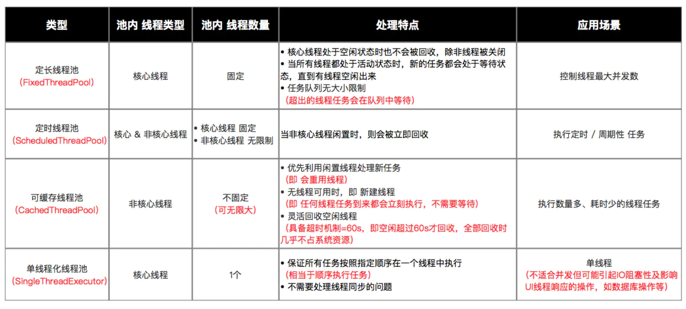

# 线程、多线程、锁

## 线程

>线程就是进程中运行的多个子任务，是操作系统调用的最小单元。

线程状态：初始、运行、阻塞、等待、超时等待、终止。

- 初始(NEW)： 新创建了一个线程对象，但还没有调用start()方法。  
- 运行(RUNNABLE)： Java线程中将就绪（ready）和运行中（running）两种状态笼统的称为“运行”。  
线程对象创建后，其他线程(比如main线程）调用了该对象的start()方法。该状态的线程位于可运行线程池中，等待被线程调度选中，获取CPU的使用权，此时处于就绪状态（ready）。就绪状态的线程在获得CPU时间片后变为运行中状态（running）。  
- 阻塞(BLOCKED)： 表示线程阻塞于锁。  
- 等待(WAITING)： 进入该状态的线程需要等待其他线程做出一些特定动作（通知或中断）。  
- 超时等待(TIMED_WAITING)： 该状态不同于WAITING，它可以在指定的时间后自行返回。  
- 终止(TERMINATED)： 表示该线程已经执行完毕。  

### sleep() 、wait()、yield()、join()的作用和区别

- Thread.sleep(long millis) 一定是当前线程调用此方法，当前线程进入TIMED_WAITING状态，但不释放对象锁，millis后线程自动苏醒进入就绪状态。作用：给其它线程执行机会的最佳方式。  

- Object.wait() 当前线程调用对象的wait()方法，当前线程释放对象锁，进入等待队列。  
<span>依靠notify()、notifyAll()唤醒或者wait(long timeout)timeout时间到自动唤醒。</span> 

- Thread.yield() 一定是当前线程调用此方法，当前线程放弃获取的CPU时间片，但不释放锁资源，由运行状态变为就绪状态，让OS再次选择线程。  
作用：让相同优先级的线程轮流执行，但并不保证一定会轮流执行。实际中无法保证yield()达到让步目的，因为让步的线程还有可能被线程调度程序再次选中。  
Thread.yield()不会导致阻塞，该方法与sleep()类似，只是不能由用户指定暂停多长时间。  

- Thread.join() 会让调用线程等待被调用线程结束后，才会继续执行。使用的场景为我们需要等待某个线程执行完成后才可继续执行的场景。

### 如何停止正在运行的线程

- 使用`thread.interrupt()`方法停止线程，可使用isInterrupted()方法配合return终止向下执行。
- 使用退出标志，使线程正常退出，也就是run()方法执行完后终止。
- 使用抛异常的方式终止执行，上层可以通过try-catch捕获异常。
- 使用stop()方法强行终止，但是不推荐，因为不安全已经废弃。

## 多线程三个特性

- **原子性**：是指一个操作是不可中断的。即使是多个线程一起执行的时候，一个操作一旦开始，就不会被其他线程干扰。  
比如，对于一个静态全局变量int i，两个线程同时对它赋值，线程A给他赋值为1，线程B给他赋值为-1。那么不管这两个线程以何种方式，何种步调工作，i的值要么是1，要么是-1，线程A和线程B之间是没有干扰的。这就是原子性的一个特点，不可被中断。

- **可见性**：是指当一个线程修改了某一个共享变量的值，其他线程是否能够立即知道这个修改。显然，对于串行来说，可见性问题是不存在的。

- **有序性**：在并发时，程序的执行可能会出现乱序。给人的直观感觉就是：写在前面的代码，会在后面执行。有序性问题的原因是因为**程序在执行时，可能会进行指令重排**，重排后的指令与原指令的顺序未必一致。

## ThreadPool

<details><summary>ThreadPoolExecutor</summary>

```java
// 1. 创建线程池
// 创建时，通过配置线程池的参数，从而实现自己所需的线程池
Executor threadPool = new ThreadPoolExecutor(
                                          CORE_POOL_SIZE,
                                          MAXIMUM_POOL_SIZE,
                                          KEEP_ALIVE,
                                          TimeUnit.SECONDS,
                                          sPoolWorkQueue,
                                          sThreadFactory
                                          );
// 注：在Java中，已内置4种常见线程池，下面会详细说明

// 2. 向线程池提交任务：execute（）
// 说明：传入 Runnable对象
threadPool.execute(new Runnable() {
    @Override
    public void run() {
        ... // 线程执行任务
    }
});

// 3. 关闭线程池shutdown() 
threadPool.shutdown();

// 关闭线程的原理
// a. 遍历线程池中的所有工作线程
// b. 逐个调用线程的interrupt（）中断线程（注：无法响应中断的任务可能永远无法终止）

// 也可调用shutdownNow（）关闭线程：threadPool.shutdownNow（）
// 二者区别：
// shutdown：设置 线程池的状态 为 SHUTDOWN，然后中断所有没有正在执行任务的线程
// shutdownNow：设置 线程池的状态 为 STOP，然后尝试停止所有的正在执行或暂停任务的线程，并返回等待执行任务的列表
// 使用建议：一般调用shutdown（）关闭线程池；若任务不一定要执行完，则调用shutdownNow（）
```

</details>

### ThreadPoolExecutor构造参数

- **corePoolSize：** 线程池的核心线程数，说白了就是，即便是线程池里没有任何任务，也会有corePoolSize个线程在候着等任务。
- **maximumPoolSize：** 最大线程数，不管你提交多少任务，线程池里最多工作线程数就是maximumPoolSize。
- **keepAliveTime：** 线程的存活时间。当线程池里的线程数大于corePoolSize时，如果等了keepAliveTime时长还没有任务可执行，则线程退出。
- **unit：** 这个用来指定keepAliveTime的单位，比如秒:TimeUnit.SECONDS。
- **workQueue：** 一个阻塞队列，提交的任务将会被放到这个队列里。
- **threadFactory：** 线程工厂，用来创建线程，主要是为了给线程起名字，默认工厂的线程名字：pool-1-thread-3。
- **handler：** 拒绝策略，当线程池里线程被耗尽，且队列也满了的时候会调用。

### 线程池的作用和优点

线程池的主要作用是用于管理子线程，优点有：
- 复用线程池中的线程，避免频繁创建和销毁线程所带来的内存开销。
- 有效控制线程的最大并发数，避免因线程之间抢占资源而导致的阻塞现象。
- 能够对线程进行简单的管理，提供定时执行以及指定时间间隔循环执行等功能。

### 常见的4类功能线程池

- 定长线程池（FixedThreadPool）
- 定时线程池（ScheduledThreadPool）
- 可缓存线程池（CachedThreadPool）
- 单线程化线程池（SingleThreadExecutor）



## 锁

- **公平锁/非公平锁**（公平锁是指多个线程按照申请锁的顺序来获取锁）  
- **可重入锁**（又名递归锁，是指在同一个线程在外层方法获取锁的时候，在进入内层方法会自动获取锁）  
- **独享锁/共享锁**（独享锁是指该锁一次只能被一个线程所持有）  
- **互斥锁/读写锁**（ReentrantLock/ReadWriteLock）  
- **乐观锁/悲观锁**（悲观锁在Java中的使用，就是利用各种锁。乐观锁在Java中的使用，是无锁编程，常常采用的是CAS算法，典型的例子就是原子类，通过CAS自旋实现原子操作的更新。）   
- **分段锁**（分段锁其实是一种锁的设计，并不是具体的一种锁）  
- **偏向锁/轻量级锁/重量级锁**（这三种锁是指锁的状态，并且是针对Synchronized）  
- **自旋锁**（自旋锁是指尝试获取锁的线程不会立即阻塞，而是采用循环的方式去尝试获取锁，这样的好处是减少线程上下文切换的消耗，缺点是循环会消耗CPU）


### synchronized

synchronized提供了**同步锁**的概念，被synchronized修饰的代码段可以防止被多个线程同时执行，必须一个线程把synchronized修饰的代码段都执行完毕了，其他的线程才能开始执行这段代码。 因为synchronized保证了在同一时刻，只能有一个线程执行同步代码块，所以执行同步代码块的时候相当于是单线程操作了，那么线程的可见性、原子性、有序性（线程之间的执行顺序）它都能保证了。

synchronized可以用来修饰以下3个层面：修饰**实例方法**；修饰**静态类方法**；修饰**代码块**。

- 修饰实例方法：锁是当前对象，只有同一个实例对象调用方法才会产生互斥效果，不同实例对象之间不会产生互斥效果。
- 修饰静态类方法：锁是当前类的Class对象，即使在不同线程中调用不同实例对象，也会有互斥效果。
- 修饰代码块：synchronized 作用于代码块时，锁对象就是跟在后面括号中的对象。任何Object对象都可以当作锁对象。

#### synchronized的缺点

- 无法判断获取锁的状态。
- 当持有锁的方法执行时间过长时就会一直占着锁不释放，导致其他使用同一锁的方法无法执行，必须等待，导致速度，效率减小。
- 当多个线程尝试获取锁的时候，未获取到锁的线程会不断尝试去获取锁而不会发生中断，这样会造成性能消耗。
- 有可能产生死锁，导致程序中断。

### volatile

其实volatile关键字的作用就是保证了可见性和有序性（不保证[原子性](#多线程三个特性)），如果一个共享变量被volatile关键字修饰，那么如果一个线程修改了这个共享变量后，其他线程是立马可知的。  
**volatile能禁止指令重新排序**，在指令重排序优化时，在volatile变量之前的指令不能在volatile之后执行，在volatile之后的指令也不能在volatile之前执行，所以它保证了有序性。  

#### synchronized和volatile的区别

1、volatile只能作用于变量，使用范围较小，synchronized可以用在方法、类、同步代码块等，使用范围比较广。  
2、volatile只能保证可见性和有序性，不能保证原子性。而可见性、有序性、原子性synchronized都可以保证。  
3、volatile不会造成线程阻塞，synchronized可能会造成线程阻塞。 

### ReentrantLock

ReentrantLock的实现是一种**自旋锁**，通过循环调用CAS操作来实现加锁。它的性能比较好也是因为避免了使线程进入内核态的阻塞状态。

ReentrantLock 的使用同 synchronized 有点不同，它的加锁和解锁操作都需要手动完成。 **lock()** 和 **unlock()。**

默认情况下，synchronized 和 ReentrantLock 都是非公平锁。但是 ReentrantLock 可以通过传入 true 来创建一个公平锁。所谓公平锁就是通过同步队列来实现多个线程按照申请锁的顺序获取锁。 

#### synchronized和ReentrantLock的区别

1、ReentrantLock可以指定是公平锁还是非公平锁。而synchronized只能是非公平锁。所谓的公平锁就是先等待的线程先获得锁。  
2、ReentrantLock提供了一个Condition（条件）类，用来实现分组唤醒需要唤醒的线程们，而不是像synchronized要么随机唤醒一个线程要么唤醒全部线程。  
3、ReentrantLock提供了一种能够中断等待锁的线程的机制，通过lock.lockInterruptibly()来实现这个机制。  

**同步实现原理：** jvm基于进入和退出Monitor对象来实现方法同步和代码块同步。

### synchronized 的优化

1. 锁膨胀（锁升级）

锁膨胀是指 synchronized 从**无锁**升级到**偏向锁**，再到**轻量级锁**，最后到**重量级锁**的过程，它叫锁膨胀也叫锁升级。
JDK 1.6 之前，synchronized 是重量级锁，也就是说 synchronized 在释放和获取锁时都会从**用户态转换成内核态**，而转换的效率是比较低的。但有了锁膨胀机制之后，synchronized 的状态就多了无锁、偏向锁以及轻量级锁了，这时候在进行并发操作时，大部分的场景都不需要用户态到内核态的转换了，这样就大幅的提升了 synchronized 的性能。

2. 锁消除

锁消除指的是在某些情况下，JVM 虚拟机如果检测不到某段代码被共享和竞争的可能性，就会将这段代码所属的同步锁消除掉，从而到底提高程序性能的目的。
锁消除的依据是**逃逸分析**的数据支持，如 StringBuffer 的 append() 方法，或 Vector 的 add() 方法，在很多情况下是可以进行锁消除的。
比如在一个方法里面定义了一个局部变量StringBuffer，因为这个局部变量不会从该方法中逃逸出去，此时我们可以使用锁消除（不加锁）来加速程序的运行。

3. 锁粗化

锁粗化是指，将多个连续的加锁、解锁操作连接在一起，扩展成一个范围更大的锁。
锁粗化的作用：如果检测到同一个对象执行了连续的加锁和解锁的操作，则会将这一系列操作合并成一个更大的锁，从而提升程序的执行效率。

4. 自适应自旋锁

自旋锁是指通过自身循环，尝试获取锁的一种方式。
自旋锁优点在于它**避免一些线程的挂起和恢复操作**，因为挂起线程和恢复线程都需要从用户态转入内核态，这个过程是比较慢的，所以通过自旋的方式可以一定程度上避免线程挂起和恢复所造成的性能开销。
如果长时间自旋还获取不到锁，那么也会造成一定的资源浪费，所以我们通常会给自旋设置一个固定的值来避免一直自旋的性能开销。
**自适应自旋锁**是指：线程自旋的次数不再是固定的值，而是一个动态改变的值，这个值会根据前一次自旋获取锁的状态来决定此次自旋的次数。
**如果线程自旋成功了，则下次自旋的次数会增多，如果失败，下次自旋的次数会减少。**

其中锁膨胀和自适应自旋锁是 synchronized 关键字自身的优化实现，而锁消除和锁粗化是 JVM 虚拟机对 synchronized 提供的优化方案。

### 深入理解 AQS 和 CAS 原理

总体来说，**AQS 是一套框架，在框架内部已经封装好了大部分同步需要的逻辑**，在 AQS 内部维护了一个状态指示器 state 和一个等待队列 Node，而通过 state 的操作又分为两种：独占式和共享式，这就导致 AQS 有两种不同的实现：独占锁（ReentrantLock 等）和分享锁（CountDownLatch、读写锁等）。

理解 AQS 的原理对理解 JUC 包中其他组件实现的基础有帮助，并且理解其原理才能更好的扩展其功能。上层开发人员可以基于此框架基础上进行扩展实现适合不同场景、不同功能的锁。其中几个有可能需要子类同步器实现的方法如下。

1、`lock()`。  
2、`tryAcquire(int)`：独占方式。尝试获取资源，成功则返回 true，失败则返回 false。  
3、`tryRelease(int)`：独占方式。尝试释放资源，成功则返回 true，失败则返回 false。  
4、`tryAcquireShared(int)`：共享方式。尝试获取资源。负数表示失败；0 表示成功，但没有剩余可用资源；正数表示成功，且有剩余资源。  
5、`tryReleaseShared(int)`：共享方式。尝试释放资源，如果释放后允许唤醒后续等待结点返回 true，否则返回 false。  

**CAS 全称是 Compare And Swap，译为比较和替换，是一种通过硬件实现并发安全的常用技术**，底层通过利用 CPU 的 CAS 指令对缓存加锁或总线加锁的方式来实现多处理器之间的原子操作。

它的实现过程主要有 3 个操作数：内存值 V，旧的预期值 E，要修改的新值 U，当且仅当预期值 E和内存值 V 相同时，才将内存值 V 修改为 U，否则什么都不做。

CAS 底层会根据操作系统和处理器的不同来选择对应的调用代码，以 Windows 和 X86 处理器为例，如果是多处理器，通过带 lock 前缀的 cmpxchg 指令对缓存加锁或总线加锁的方式来实现多处理器之间的原子操作；如果是单处理器，通过 cmpxchg 指令完成原子操作。

## 死锁

### 死锁发生的四个必要条件

1、资源互斥使用。   
2、多个进程(线程)保持一定的资源，但又请求新的资源。   
3、资源不可被剥夺。   
4、多个进程循环等待。   

### 一般死锁的应对策略有

1、死锁预防：如进程需要的所有资源，在一开始就全部申请好得到之后再开始执行。   
2、死锁避免：如进程每次申请申请资源的时候，根据一定的算法，去看该请求可能不可能造成死锁，如果可能，就不给它分配该资源。   
3、死锁处理：破坏四个必要条件的其中一个，比如kill掉一个进程。   
4、死锁忽略：不管死锁，由用户自行处理，比如重启电脑。一般的系统其实都采取这种策略。