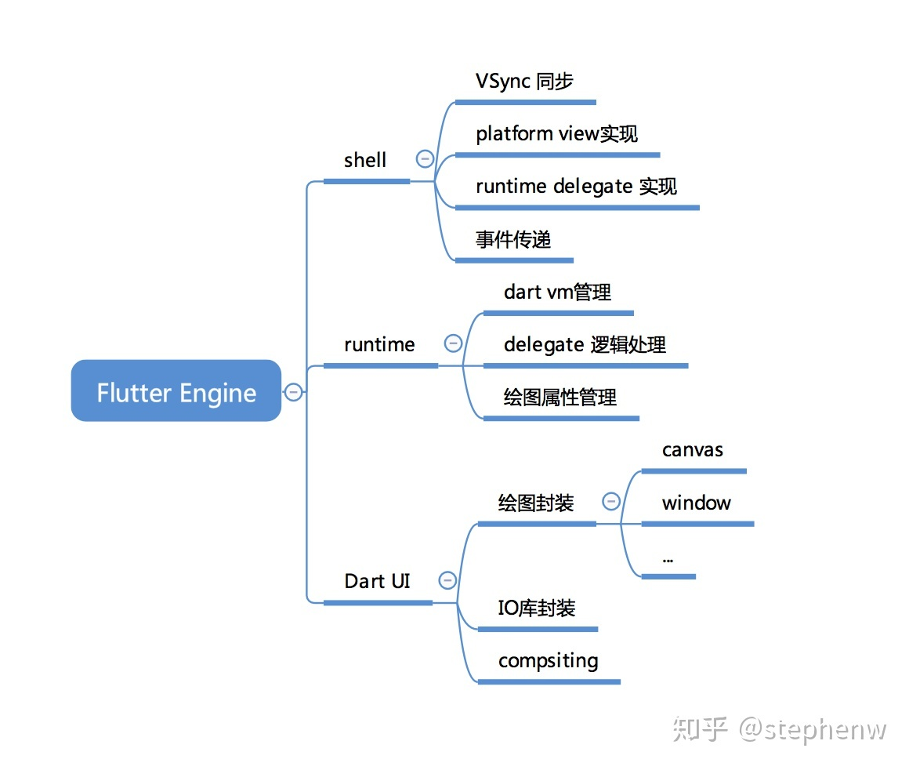

# Flutter

> Flutter 是 Google 发布的一个用于创建**跨平台、高性能**移动应用的框架。  
> Flutter 没有使用原生控件，实现了一个自绘引擎，使用自身的布局、绘制系统。

Flutter简介

从 2017 年 Google I/O 大会上，Google 首次发布 Flutter 到 2021年8月底，已经有 127K 的 Star，Star 数量 Github 上排名前 20 。经历了4年多的时间，Flutter 生态系统得以快速增长，国内外有非常多基于 Flutter 的成功案例，国内的互联网公司基本都有专门的 Flutter 团队。总之，历时 4 年，Flutter 发展飞快，已在业界得到了广泛的关注和认可，在开发者中受到了热烈的欢迎，成为了移动跨端开发中最受欢迎的框架之一。

**Flutter的优势：**

- 生态：Flutter 生态系统发展迅速，社区非常活跃，无论是开发者数量还是第三方组件都已经非常可观。
- 技术支持：现在 Google 正在大力推广Flutter，Flutter 的作者中很多人都是来自Chromium团队，并且 Github上活跃度很高。另一个角度，从 Flutter 诞生到现在，频繁的版本发布也可以看出 Google 对 Flutter的投入的资源不小，所以在官方技术支持这方面，大可不必担心。
- 开发效率：一套代码，多端运行；并且在开发过程中 Flutter 的热重载可帮助开发者快速地进行测试、构建UI、添加功能并更快地修复错误。在 iOS 和 Android 模拟器或真机上可以实现毫秒级热重载，并且不会丢失状态。这真的很棒，相信我，如果你是一名原生开发者，体验了Flutter开发流后，很可能就不想重新回去做原生了，毕竟很少有人不吐槽原生开发的编译速度。

**跨平台技术对比：**

|技术类型|UI渲染方式|性能|开发效率|动态化|框架代表|
|--|--|--|--|--|--|
|H5 + 原生|WebView渲染|一般|高|支持|Cordova、Ionic|
|JavaScript + 原生渲染|原生控件渲染|好|中|支持|RN、Weex|
|自绘UI + 原生|调用系统API渲染|好|Flutter高, Qt低|默认不支持|Qt、Flutter|

**Flutter为什么不支持动态化？**

Flutter 的 Release 包默认是使用 Dart AOT 模式编译的，所以不支持动态化，但 Dart 还有 JIT 或 snapshot 运行方式，这些模式都是支持动态化的。

> [美团外卖Flutter动态化实践](https://tech.meituan.com/2020/06/23/meituan-flutter-flap.html)

Dart简介

**Dart是单线程模型，所以也就没有了所谓的主线程/子线程之分。**

Dart也是**Event-Looper**以及**Event-Queue**的模型，所有的事件都是通过**EventLooper**依次执行。  
而Dart的EventLoop就是： 从EventQueue中获取Event， 处理Event， 直到EventQueue为空。

Dart在异步调用中有三个关键词，**async、await、Future**，其中async和await需要一起使用。

在Dart中可以通过async和await进行异步操作，async表示开启一个异步操作，也可以返回一个Future结果。
如果没有返回值，则默认返回一个返回值为null的Future。

async、await本质上就是Dart对异步操作的一个语法糖，可以减少异步调用的嵌套调用，并且由async修饰后返回一个Future，外界可以以链式调用的方式调用。这个语法是JS的ES7标准中推出的，Dart的设计和JS相同。

**Future就是延时操作的一个封装，可以将异步任务封装为Future对象**。获取到Future对象后，最简单的方法就是用await修饰，并等待返回结果继续向下执行。正如上面async、await中讲到的，使用await修饰时需要配合async一起使用。

**isolate是Dart平台对线程的实现方案**，但和普通Thread不同的是，isolate拥有独立的内存，**isolate由线程和独立内存构成**。正是由于isolate线程之间的内存不共享，所以isolate线程之间并不存在资源抢夺的问题，所以也不需要锁。

为什么使用 Dart？

这是一个很有意思的问题，Flutter选择了 Dart而不是 JavaScript。我觉得主要有以下几个原因：

- Dart 的性能更好。Dart在 JIT模式下，速度与 JavaScript基本持平。但是 Dart支持 AOT，当以 AOT模式运行时，JavaScript便远远追不上了。速度的提升对高帧率下的视图数据计算很有帮助。
- Native Binding。在 Android上，v8的 Native Binding可以很好地实现，但是 iOS上的 JavaScriptCore不可以，所以如果使用 JavaScript，Flutter 基础框架的代码模式就很难统一了。而 Dart的 Native Binding可以很好地通过 Dart Lib实现。
- Fuchsia OS，看起来不像原因的一个原因。Fuchsia OS内置的应用浏览器就是使用 Dart语言作为 App的开发语言。而且实际上，Flutter是 Fuchisa OS的应用框架概念上的一个子集。（Flutter源代码和编译工具链也充斥了大量的 Fuchsia宏）
- Dart是类型安全的语言，拥有完善的包管理和诸多特性。Google召集了如此多个编程语言界的设计专家开发出这样一门语言，旨在取代 JavaScript，所以 Fuchsia OS内置了 Dart。Dart可以作为 embedded lib嵌入应用，而不用只能随着系统升级才能获得更新，这也是优势之一。

## 绘制原理

显示器以固定的频率刷新，比如 iPhone的 60Hz、iPad Pro的 120Hz。当一帧图像绘制完毕后准备绘制下一帧时，显示器会发出一个垂直同步信号（VSync），所以 60Hz的屏幕就会一秒内发出 60次这样的信号。
Android每16ms发送一次刷新信号。

Flutter和 React-Native之众的本质区别：React-Native之类只是扩展调用 OEM组件，而 Flutter是自己渲染。

Flutter只关心向 GPU提供视图数据，GPU的 VSync信号同步到 UI线程，UI线程使用 Dart来构建抽象的视图结构，这份数据结构在 GPU线程进行图层合成，视图数据提供给 Skia引擎渲染为 GPU数据，这些数据通过 OpenGL或者 Vulkan提供给 GPU。

所以 Flutter并不关心显示器、视频控制器以及 GPU具体工作，它只关心 GPU发出的 VSync信号，尽可能快地在两个 VSync信号之间计算并合成视图数据，并且把数据提供给 GPU。

## Flutter与Activity通信

- 通过EventChannel来实现，EventChannel仅支持数据单向传递，无返回值，用于数据流（event streams）的通信。  
- 通过MethodChannel来实现，MethodChannel支持数据双向传递，有返回值，用于传递方法调用（method invocation）。  
- 通过BasicMessageChannel来实现，BasicMessageChannel支持数据双向传递，有返回值，可用于传递字符串和半结构化的信息。  
- 通过dart：ffi库调用原生C API。

## Widget、Element、RederObject

Widget 是 Flutter 里对视图的一种结构化描述，你可以把它看作是前端中的“控件”或“组件”。Widget 是控件实现的基本逻辑单位，里面存储的是有关视图渲染的配置信息，包括布局、渲染属性、事件响应信息等。

Element 是 Widget 的一个实例化对象，它承载了视图构建的上下文数据，是连接结构化的配置信息到完成最终渲染的桥梁。  
Flutter 中真正代表屏幕上显示元素的类是Element，Widget 只是描述 Element 的配置数据，并且一个Widget 可以对应多个Element。

RenderObject为应用程序提供真正的渲染。它的主要职责是绘制和布局，是一个真正的渲染对象。

首先，通过 Widget 树生成对应的 Element 树；  
然后，创建相应的 RenderObject 并关联到 Element.renderObject 属性上；  
最后，构建成的 RenderObject 树来完成布局的排列和绘制，以完成最终的渲染。  

## setState刷新原理

调用一个Widget的setState()方法，它会将当前Widget及其所有子Widget都标记要重新刷新的状态，等待下一个Vsync刷新信号到来时重新刷新所有这些标记为刷新状态的控件，也就是调用他们的build方法。

局部刷新的话可以给子部件Widget添加一个GlobalKey，完成跟Element的绑定，拿到子部件Widget的State来进行刷新。

## 状态管理

- 业务逻辑与界面没有分离，可阅读差、维护困难增加；
- 不方便多个widget之间的状态通信；
- 不能做到局部重绘，如果每次重绘widget中所有的元素，那么性能肯定不理想。

Provider：是为恒定的数据提供的方法(类)。当一个widget只是从这个model中取数据，而不去监听数据的变化而去重绘界面.

比如列表的状态，订单的状态发生改变等。

FutureProvider: 可以给FutureProvider提供一份初始的数据Model，通过Future方法返回新的Model数据，刷新ui。FutureProvider可以用于只有第一次需要刷新的ui。

比如网络请求，只需要请求一次没有刷新。

StreamProvider： 可以给StreamProvider提供一份初始的数据Model，通过给StreamProvider设置了一个每隔1秒更新一次的stream，ui上的计数值也是每隔一秒改变一次。

比如倒计时组件。

ValueListenableProvider：ValueListenableProvider通过构造器绑定数据并进行监听。当一个数据发生变化时，要重绘widget对应的元素时，可以用它。

比如购物车商品点击+号，对应的数量发生改变。

MultiProvider：可以组合Provider所提供的类，给Ui提供多个数据Model。

ChangeNotifierProvider：当model对像中有数据变化时，需要触发widget中的元素重绘，实现数据驱动，这时我们需要用到ChangeNotifierProvider。

model类必须继承ChangeNotifier类; 当需要更新widget时内容时，需要在model类中调用notifyListeners()。

ChangeNotifierProxyProvider：当一个model依赖另一个model时，就以用ChangeNotifierProxyProvider把依赖的model推给被依赖model对像。

比如点击优惠券展示优惠券详情的弹窗等。

ListenableProvider：与ChangeNotifierProxyProvider的作用及用法基本相似, 所不同的是也像ChangeNotifierProxyProvider.value一样，当widget注销后，不会触发model中的dispose方法。

## StatefulWidget生命周期

createState()->initSate()->didChangeDependencies()->build()->deactivate()->dispose()

- createState()：当 StatefulWidget 组件插入到组件树中时 createState函数由 Framework 调用，此函数在树中给定的位置为此组件创建 State，如果在组件树的不同位置都插入了此组件，即创建了多个此组件。
- initSate()：initState函数在组件被插入树中时被 Framework 调用（在 createState 之后），此函数只会被调用一次，子类通常会重写此方法，在其中进行初始化操作，比如加载网络数据，重写此方法时一定要调用 super.initState()。
- didChangeDependencies()：didChangeDependencies 方法在 initState 之后由 Framework 立即调用。另外，当此 State对象的依赖项更改时被调用，比如其所依赖的 InheritedWidget 发生变化时， Framework 会调用此方法通知组件发生变化。
- build()：在方法中创建各种组件，绘制到屏幕上。（调用 initState 方法后，调用 didUpdateWidget 方法后，收到对 setState 的调用后）
- didUpdateWidget()：当组件的 configuration发生变化时调用此函数，当父组件使用相同的 runtimeType 和 Widget.key 重新构建一个新的组件时，Framework 将更新此 State 对象的组件属性以引用新的组件，然后使用先前的组件作为参数调用此方法。
- deactivate()：当框架从树中移除此 State 对象时将会调用此方法，在某些情况下，框架将重新插入 State 对象到树的其他位置（例如，如果包含该树的子树 State 对象从树中的一个位置移植到另一位置），框架将会调用 build 方法来提供 State 对象适应其在树中的新位置。
- dispose()：当框架从树中永久移除此 State 对象时将会调用此方法，与 deactivate的区别是，deactivate 还可以重新插入到树中，而 dispose 表示此 State 对象永远不会在 build。调用完 dispose后，mounted 属性被设置为 false，也代表组件生命周期的结束，此时再调用 setState 方法将会抛出异常。

- StatefulWidget的内部逻辑与状态，由StatefulWidget的createState创建。
- StatefulWidget实例本身是不可变的， 在StatefulWidget中它可变的状态存储在与之关联的State对象中，不管什么时候，只要在树中mount一个新的StatefulElement（必然需要注入一个StatefulWidget）或注入一个StatefulWidget时，framework都会调用一次createState方法。（在StatefulElement构造的时候，就会调用createState，创建_state对象）。
- 这意味着如果StatefulWidget被插入到树中的多个位置，则会有多个State对象分别与它们关联。

## StatelessWidget和StatefulWidget的区别

- StatelessWidget: 不会发生状态改变的Widget，一旦创建就不关心任何变化，在下次构建之前都不会改变。它们除了依赖于自身的配置信息（在父节点构建时提供）外不再依赖于任何其他信息。
- StatefulWidget: 在生命周期内，该类 Widget 所持有的数据可能会发生变化，这样的数据被称为 State，这些拥有动态内部数据的 Widget 被称为 StatefulWidget。
- StatefulWidget 由两部分组成，在初始化时必须要在 createState()时初始化一个与之相关的 State 对象。

## LocalKey、GlobalKey的作用和区别

GlobalKey 使用了一个静态常量 Map 来保存它对应的 Element。  
你可以通过 GlobalKey 找到持有该GlobalKey的 Widget，State 和 Element，能够跨 Widget 访问状态。  
GlobalKey可以主动获取以及主动改变子控件的状态。

LocalKey 直接继承至 Key，它应用于拥有相同父 Element 的小部件进行比较的情况，有一个多子 Widget 中需要对它的子 widget 进行移动处理，这时候你应该使用LocalKey。

LocalKey 派生出了许多子类 key：
- ValueKey : ValueKey(‘String’)，根据值唯一性操作某一个widget
- ObjectKey : ObjectKey(Object)，根据对象唯一性操作某一个widget
- UniqueKey : UniqueKey()，每一个 Key 都具有唯一性，它将会通过该对象生成一个具有唯一性的 hash 码。每次 Widget 被构建时都会去重新生成一个新的 UniqueKey，失去了一致性。
- ValueKey 又派生出了 PageStorageKey : PageStorageKey(‘value’)：能够保持 Sliver 的滚动状态

> [Flutter中关于setState的理解(三)](https://www.jianshu.com/p/24018d234210)
> [Flutter中Widget 、Element、RenderObject角色深入分析](https://zhuanlan.zhihu.com/p/183645816)  
> [Flutter渲染之Widget、Element 和 RenderObject](https://www.jianshu.com/p/71bb118517b1)