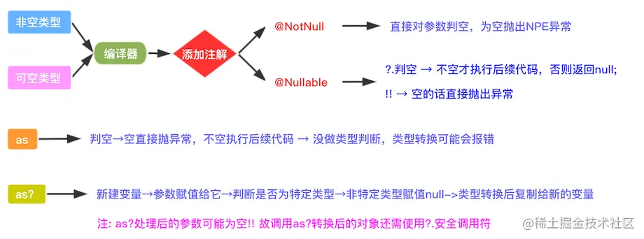

# Kotlin

**Kotlin相对于Java的优势**

- Kotlin是Google推荐的Android首选开发语言。

- 空指针安全。Kotlin中变量有非空类型和可空类型，可空类型需要在变量类型后加上 ? ，在使用时Kotlin会判断变量是否为空。  
  - 非空类型的属性编译器添加@NotNull注解，可空类型添加@Nullable注解
  - 非空类型直接对参数进行判空，如果为空直接抛出异常
  - 可空类型，如果是?.判空，不空才执行后续代码，否则返回null；如果是!!，空的话直接抛出NPE异常
  - as操作符会判空，空的话直接抛出异常，不为空才执行后续操作，没做类型判断！运行时可能会报错
  - as?则是新建一个变量，参数赋值给它，然后判断是否为特定类型，赋值为null，接着把这个变量的值赋值给另一个新的变量，这里有一点注意：as?处理后的参数可能为空！！！所以调用as?转换后的对象还需要添加安全调用操作符(?.)

- 扩展函数。Kotlin可以给类添加扩展函数，方便调用。

- 函数式支持。Kotlin可以将方法当作参数来进行传递，可以减少匿名内部类的创建。

- 操作符便利。Kotlin中有apply、let、map等一系列可节省代码量的操作符。

- 协程。Kotlin的协程可以用同步的方式来写异步的代码，同时使线程间切换更加方便快捷。

## Kotlin空安全原理

## 协程

> 协程是一种并发设计模式，您可以在 Android 平台上使用它来简化异步执行的代码。

1.kotlin协程本质上对线程池的封装。  
2.kotlin协程可以用同步方式写异步代码，自动实现对线程切换的管理。

在我看来，协程和线程一样都是用来解决并发任务（异步任务）的方案。所以协程和线程是属于一个层级的概念，但是对于kotlin中的协程，又与广义的协程有所不同。kotlin中的协程其实是对线程的一种封装，或者说是一种线程框架，为了让异步任务更好更方便使用。

优点：
- 轻量：您可以在单个线程上运行多个协程，因为协程支持挂起，不会使正在运行协程的线程阻塞。挂起比阻塞节省内存，且支持多个并行操作。
- 内存泄露更少：使用结构化并发机制在一个作用域内执行多个操作。
- 内置取消支持：取消功能会自动通过正在运行的协程层次结构传播。
- Jetpack集成：许多 Jetpack 库都包含提供全面协程支持的扩展。某些库还提供自己的协程作用域，可供您用于结构化并发。

CoroutineScope：即协程运行的作用域，主要作用是提供CoroutineContext，协程运行的上下文。  
常见的有GlobalScope,LifecycleScope,ViewModelScope。

GlobalScope与ViewModelScope有什么区别？  
1. GlobalScope返回的为CoroutineContext的空实现。  
2. ViewModelScope则往CoroutineContext中添加了Job与Dispatcher。

什么是调度器？

- 从使用上来讲，调度器就是我们使用的Dispatchers.Main,Dispatchers.Default，Dispatcher.IO等；
- 从作用上来讲，调度器的作用是控制协程运行的线程；
- 从结构上来讲，Dispatchers的父类是ContinuationInterceptor,然后再继承于CoroutineContext。

## 线程切换原理

1. 用handler切换到了主线程

2. 调用CoroutineDispatcher.dispatch方法切换线程；  
3. 切换完成后调用DispatchedTask.run方法，执行真正的协程体

delay的切换也是通过拦截器来实现的，内置的拦截器同时也实现了Delay接口。
- 可以看出，其实也是通过handler.postDelayed实现延时效果的。
- 时间到了之后，再通过resumeUndispatched方法恢复协程。
- 如果我们用的是Dispatcher.IO，效果也是一样的，不同的就是延时效果是通过切换线程实现的

withContext是怎样切换线程的?

- withContext其实就是一层Api封装，最后调用到了startCoroutineCancellable,这就跟launch后面的流程一样了;
- 传入的context会覆盖外层的拦截器并生成一个newContext，因此可以实现线程的切换;
- DispatchedCoroutine作为complete传入协程体的创建函数中，因此协程体执行完成后会回调到afterCompletion中;
- DispatchedCoroutine中传入的uCont是父协程，它的拦截器仍是外层的拦截器，因此会切换回原来的线程中。

总结：
- 向CoroutineContext添加Dispatcher，指定运行的协程
- 在启动时将suspend block创建成Continuation,并调用intercepted生成DispatchedContinuation
- DispatchedContinuation就是对原有协程的装饰，在这里调用Dispatcher完成线程切换任务后，resume被装饰的协程，就会执行协程体内的代码了

其实kotlin协程就是用装饰器模式实现线程切换的。

> [Kotlin协程到底是怎么切换线程的？你是否知晓？](https://blog.csdn.net/u012165769/article/details/118488207)
